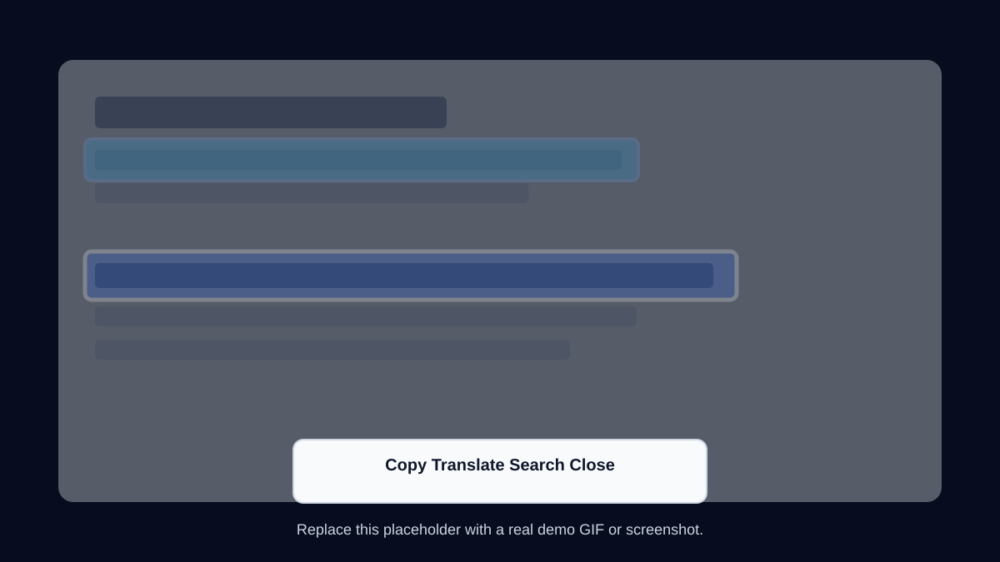

<!-- ARTEMIS-IGNIS-TOP:START -->
<p align="center">
  
</p>
<!-- ARTEMIS-IGNIS-TOP:END -->

<!-- ARTEMIS-IGNIS-BADGE-BAR:START -->
<p align="center">
  
  
  
  
</p>
<!-- ARTEMIS-IGNIS-BADGE-BAR:END -->
<p align="center"><a href="README.ko.md">한국어</a></p>

# Open Click to Do

**Win+Q screen OCR, copy, and instant translation for every Windows PC.**


> This is not Microsoft Click to Do. It is an open-source Click to Do-style screen OCR and action overlay for Windows.



Open Click to Do gives regular Windows PCs a fast `Win+Q` workflow for screen OCR, copying text from images or apps, quick browser translation, and web search. It does not require Copilot+ hardware.

If you searched for Click to Do for regular Windows PC, Win+Q OCR, copy text from screen, screen translate Windows, PowerToys Text Extractor alternative, or Copilot+ Click to Do alternative, this project is for you.

## Quick Start

1. Download or clone this repository.
2. Run PowerShell as Administrator.
3. Run:

```powershell
Set-ExecutionPolicy -Scope Process Bypass -Force
.\install.ps1
```

After installation, press `Win+Q` to open the overlay.

## Features

- `Win+Q` overlay powered by AutoHotkey v2
- Screen OCR through Windows built-in OCR APIs
- Copy text from anywhere on screen
- Quick browser translation
- Web search for selected text
- Works without Copilot+ hardware
- Local settings at `%APPDATA%\OpenClickToDo\settings.json`

## This Is Not Microsoft Click to Do

Open Click to Do does not enable, patch, unlock, disable, or modify Microsoft Click to Do. It does not touch Copilot, WSAIFabricSvc, WorkloadsSessionHost, WindowsWorkload packages, WindowsApps, or related policies.

It is a separate open-source Windows utility that provides a similar user experience: capture the screen, run OCR, show selectable text regions, and offer quick actions.

This repository is also separate from `Copilot AI Memory Saver`. Open Click to Do is a productivity app for general Windows users. Copilot AI Memory Saver is a different project focused on Copilot+ PC memory behavior.

## Who Is This For?

- Users without Copilot+ PCs
- Users who want `Win+Q` OCR actions
- Users who want fast copy or translation from screenshots, apps, images, PDFs, and videos
- Users who prefer a small utility over Copilot AI features
- Users who want a more action-oriented workflow than PowerToys Text Extractor

## Usage

Press `Win+Q` while the AutoHotkey script is running.

The app captures the primary screen, runs Windows OCR, and shows a dark overlay with detected text regions. Click a text block, then choose:

- `Copy`
- `Translate`
- `Search`
- `Close`

Keyboard shortcuts:

- `Ctrl+C`: copy selected text
- `Enter`: run the default action, currently Copy
- `Esc`: close the overlay

To test without installing the hotkey, run the app normally and click `Capture Now`, or run:

```powershell
.\src\OpenClickToDo\bin\Release\net8.0-windows10.0.19041.0\win-x64\OpenClickToDo.exe --capture
```

## Hotkey Customization

The default hotkey is `Win+Q`, written as `#q` in AutoHotkey v2.

To use `Win+Shift+Q`, edit `scripts/WinQ-OpenClickToDo.ahk`:

```ahk
#+q:: {
    Run '"' ExePath '" --capture', InstallDir
}
```

Then reinstall or copy the edited script to `%LOCALAPPDATA%\OpenClickToDo\scripts\WinQ-OpenClickToDo.ahk`.

## Build

Requirements:

- Windows 10 or Windows 11
- .NET 8 SDK
- Windows OCR language support
- AutoHotkey v2 for the global hotkey

Build:

```powershell
dotnet build .\src\OpenClickToDo\OpenClickToDo.csproj
```

Publish:

```powershell
dotnet publish .\src\OpenClickToDo\OpenClickToDo.csproj -c Release -r win-x64 --self-contained false -o .\artifacts\publish\win-x64
```

## Translation

The MVP works without API keys.

The default `Translate` action opens a browser translation page with the selected text URL-encoded. This can send selected text to the chosen translation website.

Provider slots are included for:

- Browser
- DeepL
- OpenAI
- Gemini
- Ollama
- LibreTranslate

Browser is complete in the MVP. Ollama has a local HTTP structure for users who want to keep translation local. Other provider slots are intentionally not wired until credentials and privacy controls are added.

## Privacy

- OCR is local by default through Windows OCR.
- Copy is local.
- Browser Translate sends selected text to the chosen translation website.
- API translation providers send selected text to that provider.
- Ollama or other local providers can keep text local.
- Logs do not store the full selected source text; translation logs record provider and text length only.
- Settings are stored at `%APPDATA%\OpenClickToDo\settings.json`.

See [docs/privacy.md](docs/privacy.md).

## Limitations

- OCR accuracy depends on installed Windows OCR language support.
- Handwriting, tiny text, low-resolution images, and heavily stylized text may fail.
- Browser Translate is not a fully in-app instant translation UI.
- In-app translation requires provider setup.
- `Win+Q` may override existing Windows shortcuts while the AHK script is running.
- The MVP focuses on the primary monitor first.
- Drag-select OCR regions is planned but not completed in this MVP.

## Roadmap

- Drag-select OCR regions
- Inline translation UI
- Local LLM actions
- Summarize, explain, and rewrite actions
- Multi-monitor polish
- Portable release
- Microsoft Store and winget package

See [docs/roadmap.md](docs/roadmap.md).

## Troubleshooting

See [docs/troubleshooting.md](docs/troubleshooting.md) for checks covering AutoHotkey, OCR language packs, execution policy, multiple app instances, and translation browser launch issues.

## License

MIT

<!-- ARTEMIS-IGNIS-BADGES:START -->
<p align="center">
  
</p>
<!-- ARTEMIS-IGNIS-BADGES:END -->

